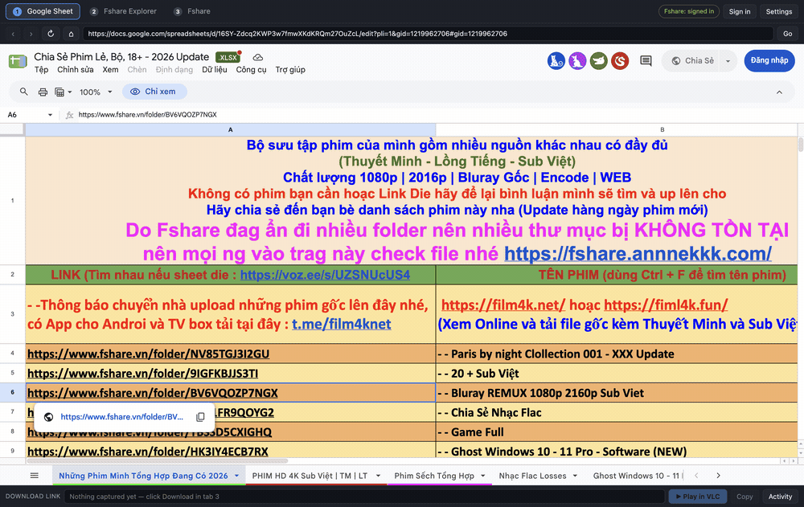
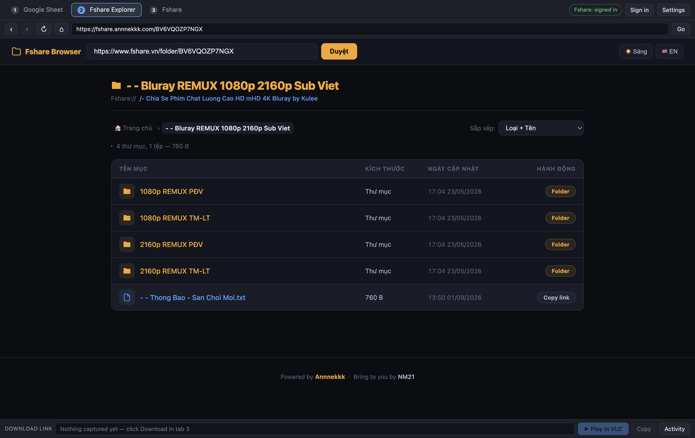
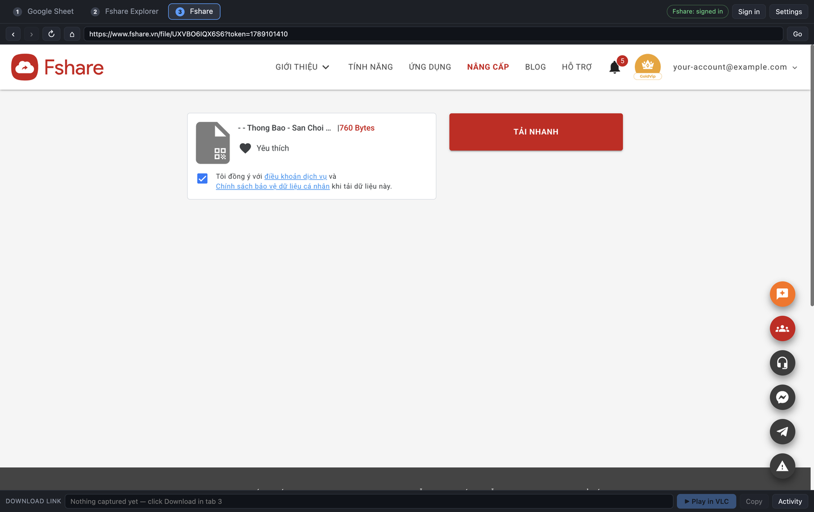
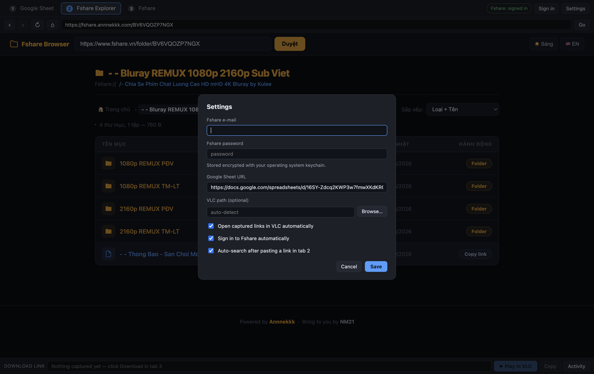

**English** · [Tiếng Việt](README.vi.md)

# Fshare Tabs

A small cross-platform desktop app (Electron) that chains together the flow:

```
Tab 1  Google Sheet         click an fshare folder link
   ↓                        the link is captured and opened in
Tab 2  fshare.annnekkk.com  browse the folder, pick one file
   ↓                        the file link is handed to
Tab 3  fshare.vn            signs in with your saved account,
   ↓                        you press Download and the real
VLC                         download URL is streamed, not saved
```

Nothing is downloaded to disk — the download is intercepted and the URL is handed
straight to VLC (and copied to your clipboard as a backup).

## Download

Prebuilt apps are on the [releases page](https://github.com/xmllist/fshare-tabs/releases/latest):
macOS (Apple Silicon and Intel, needs macOS 13+) and Windows (x64 installer, x64 portable,
ARM installer). VLC must be installed separately.

Neither platform's build is code-signed — see [Getting past "app is damaged"](#getting-past-app-is-damaged-on-another-mac)
below for macOS, and choose **More info → Run anyway** on the Windows SmartScreen prompt.

## What it looks like



Click an Fshare link in the sheet → the folder opens in the explorer → pick a file and it
loads in Fshare, already signed in. Pressing **Tải nhanh** then hands the real URL to VLC.

### Tab 1 — the Google Sheet


The sheet loads exactly as it does in a browser. Clicking any `fshare.vn` link is
intercepted instead of opening a new window.

### Tab 2 — the folder explorer



The folder code is opened directly, and the original link is typed into the site's own
search box. Clicking a file name — or its **Copy link** button — sends it to tab 3.

### Tab 3 — Fshare, already signed in



The tab signs itself in with your stored account, so the download button is ready
immediately. Pressing it never writes a file: the URL is captured and streamed in VLC.
*(The account e-mail is replaced with a placeholder in these screenshots.)*

### Settings



Two fields for the Fshare account, plus the sheet URL, the VLC path, and the automation
toggles.

## Run it from source

```bash
npm install
npm start
```

## Build installers

```bash
npm run dist:mac     # .dmg + .zip   (run on macOS)
npm run dist:win     # .exe installer + portable  (run on Windows)
npm run dist         # whatever the current OS supports
```

Output lands in `dist/`. Windows installers must be built on Windows (or on a machine
with Wine); the code itself is identical on both platforms.

## Getting past "app is damaged" on another Mac

The builds are ad-hoc signed but **not notarized** — notarization needs a paid Apple
Developer ID. macOS only enforces that when a file carries the `com.apple.quarantine`
extended attribute, and **the attribute is added by whatever moved the file**, not by the
file format. Three ways through, in order of effort:

### 1. Transfer it with a tool that does not set quarantine (free, nothing to run)

| Transfer method | Quarantined? |
|---|---|
| `curl` / `wget` download | no — opens normally |
| `scp`, `rsync` (without `-X`), `cp` from a USB drive | no — opens normally |
| USB stick formatted exFAT/FAT32 | no — the filesystem cannot store the attribute |
| Safari/Chrome download, AirDrop, Mail, Messages | **yes** |

Verified: a tarball fetched with `curl` extracts to an app with zero quarantine attributes
and a valid signature. Note that quarantine **propagates through archives** — extracting a
browser-downloaded `.zip`/`.tar.gz`/`.dmg` marks every file inside, so zipping it up does
not help by itself.

`npm run dist:mac:tar` packs each built `.app` into a `.tar.gz` suitable for this route.
On the target Mac:

```bash
curl -O http://<your-machine>:8000/Fshare-Tabs-1.0.0-x64-mac.tar.gz
tar -xzf Fshare-Tabs-1.0.0-x64-mac.tar.gz
mv "Fshare Tabs.app" /Applications/
```

### 2. Clear the flag after transfer (free, one command per machine)

```bash
xattr -dr com.apple.quarantine "/Applications/Fshare Tabs.app"
```

Use this whenever the app arrived by browser download or AirDrop. Right-click → Open does
*not* work for the "damaged" message — that wording means an untrusted signature plus
quarantine, and only clearing the attribute gets past it.

### 3. Sign and notarize properly (99 USD/year, then it just works)

With an Apple Developer Program membership and a *Developer ID Application* certificate in
your login keychain:

```bash
export APPLE_TEAM_ID=XXXXXXXXXX
export APPLE_ID=you@example.com
export APPLE_APP_SPECIFIC_PASSWORD=abcd-efgh-ijkl-mnop   # from appleid.apple.com
npm run dist:mac:signed
```

`electron-builder.signed.js` turns on the hardened runtime, applies
`build/entitlements.mac.plist`, and uploads the build to Apple for notarization. The
resulting DMG opens anywhere with no warning and no commands. The ad-hoc signing step
stands down automatically when a real identity is configured.

Windows has the same situation: unsigned means a SmartScreen prompt ("More info" → "Run
anyway"), removed by an EV/OV code-signing certificate.

## First run

Open **Settings** and fill in:

| Field | Notes |
|---|---|
| Fshare e-mail / password | The two sign-in fields. Stored encrypted with the OS keychain (macOS Keychain / Windows DPAPI). |
| Google Sheet URL | Defaults to the movie sheet; change it to use another sheet. |
| VLC path | Optional. Auto-detected in the usual install locations. |

Toggles: auto-play captured links in VLC, auto sign-in to Fshare, auto-search after a
link is pasted into tab 2.

## How each step works

* **Tab 1 → Tab 2.** Clicks on `fshare.vn` links are intercepted (both real clicks and
  `target="_blank"` pop-ups). A `/folder/CODE` link opens directly as
  `https://fshare.annnekkk.com/CODE` and the original link is also typed into the site's
  search box. A `/file/CODE` link skips tab 2 — the explorer only browses folders — and
  goes straight to tab 3.
* **Tab 2 → Tab 3.** Clicking a file name, or using the row's *copy link* button, sends
  that link to tab 3.
* **Sign-in.** If tab 3 loads a page while signed out, the app detours through
  `fshare.vn/site/login`, fills both fields, submits, and returns to the page you wanted.
  It stops after two failed attempts so a wrong password can't loop.
* **Download → VLC.** The real URL is caught four different ways: the browser's own
  download event, direct navigation to a `download*.fshare.vn/dl/…` URL, `fetch`/`XHR`
  responses containing one, and pop-up/copy-link actions. Whichever fires first wins;
  duplicates within 8 seconds are ignored.

The **Activity** button at the bottom shows exactly what the app captured and did.

## Layout

| File | Role |
|---|---|
| `main.js` | Window, tab routing, download capture, sign-in state machine, VLC launch, settings storage |
| `inject.js` | Scripts injected into each tab's page |
| `preload-web.js` | Bridge between a page and the app (pages never touch IPC) |
| `preload-host.js` | The API the app's own UI is allowed to call |
| `renderer/` | The app's UI: tab bar, address bar, activity log, settings |

## Notes

* Tabs are `<webview>` elements sharing one persistent session, so Google and Fshare
  logins survive restarts.
* Pages run with node integration off and context isolation on.
* If VLC can't be started, the link is still on your clipboard — paste it into
  VLC → File → Open Network Stream.
* A `<webview>` must have `display: flex`, or its internal iframe collapses to 150px and
  the page renders black.
* A webview stops compositing while hidden, so switching tabs forces it to repaint.
  Stacking the tabs with z-index instead of hiding them is not an alternative: guest
  surfaces ignore z-index and the wrong page ends up on top.
